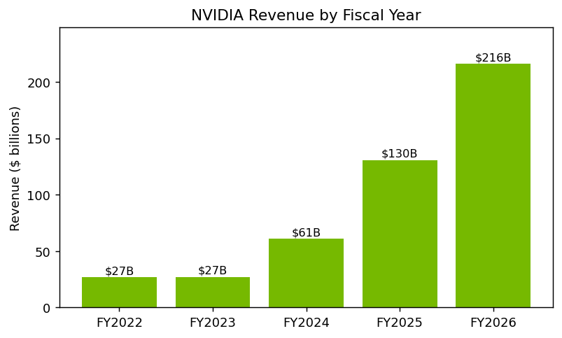
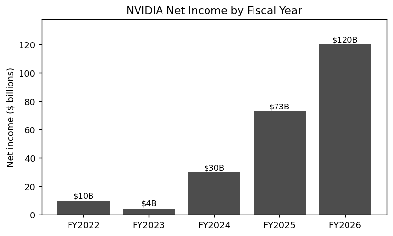
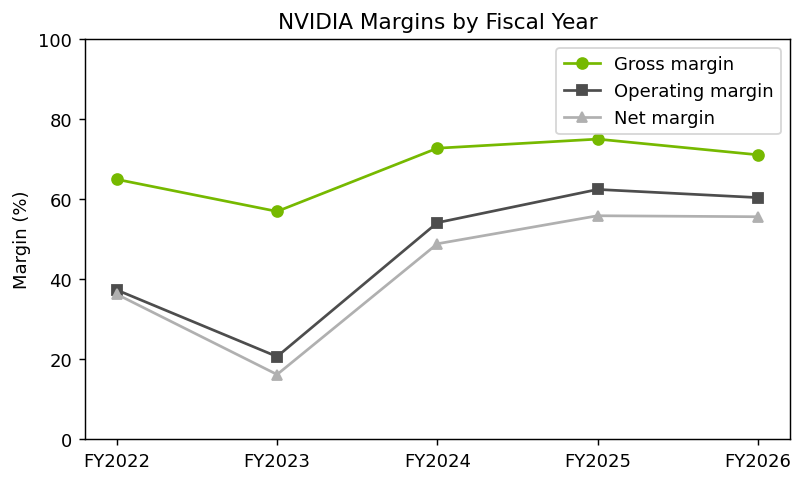
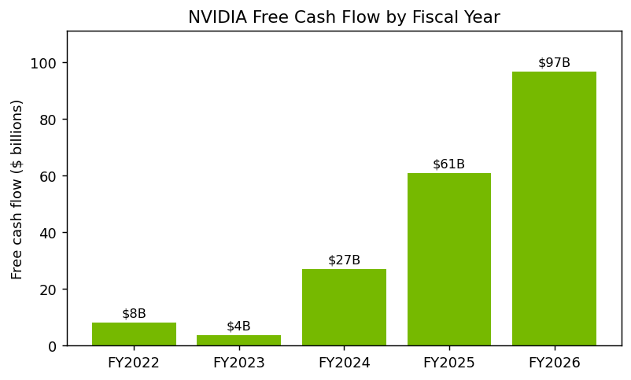

# NVIDIA Corporation (NASDAQ: NVDA)
## Equity Research & Valuation

| | |
|---|---|
| **Rating** | **HOLD / Neutral** |
| **Current price** | $224.15 (September 9, 2026) |
| **DCF base case** | ~$165 |
| **DCF range (sensitivity)** | ~$131 – $257 |
| **Comparable companies** | ~$277–$500 (NVIDIA trades below peers) |

### Investment thesis in brief
- **Exceptional operating performance** — ~65% revenue growth in FY2026, ~60% operating margin, ~45% free-cash-flow margin, and a net-cash balance sheet.
- **DCF says modestly expensive** — the base case (~$165) sits about 26% below the market price on my cash-flow assumptions, and the terminal value is ~77% of the total, so it rests heavily on the long run.
- **Comps say the opposite** — NVIDIA trades at *lower* P/E and EV/EBITDA multiples than every AI-chip peer (AMD, Broadcom, Marvell), despite higher growth and margins. This likely reflects the market already pricing in some normalization of NVIDIA's exceptional growth — but on a relative basis it still looks reasonably valued, not expensive.
- **Verdict: Hold** — a great business at a full-but-defensible price. The two valuation methods disagree, which is the real signal: the outcome depends on assumptions (AI demand durability, competition, export policy) that could break either way, and there's limited margin of safety for a new buyer.

### Key Takeaways
- Revenue grew from about **$27B (FY2022) to $216B (FY2026)**, driven almost entirely by the Data Center / AI segment.
- FY2026 operating margin was approximately **60%**, up from ~21% in FY2023.
- FY2026 free cash flow reached approximately **$97B** (~45% FCF margin).
- The DCF base case (~$165) sits **below** the current share price (~$224), implying the market prices in years of continued strong execution.
- Relative valuation suggests NVIDIA is **more reasonably valued than its AI-chip peers**, trading at a lower forward P/E despite better fundamentals.
- The resulting investment view is **Hold** — strong fundamentals offset by meaningful valuation uncertainty.

*Educational project — not professional investment advice. All financial data is from NVIDIA's 10-K filings (fiscal years end in late January; FY2026 ended January 25, 2026). Share price and peer multiples are a snapshot as of September 9, 2026, entered manually rather than pulled from a live feed.*

---

## 1. Executive Summary

NVIDIA designs the graphics processing units (GPUs) and computing platforms that
power most of the world's artificial-intelligence training and inference. Over the
last three years it has gone from a large chip company into the central supplier
of AI infrastructure, and the financials show it: revenue grew from about **$27B
in FY2023 to about $216B in FY2026**, and the most recent trailing-twelve-month
figure is already near **$303B**.

Profitability is unusually high for a hardware company. In FY2026 NVIDIA earned a
**~60% operating margin** and a **~45% free-cash-flow margin**, producing roughly
**$120B of net income** and **$97B of free cash flow**. The balance sheet is
strong — about **$63B in cash and investments against only ~$11B of debt**, a net
cash position of roughly **$51B**.

The investment question is not whether NVIDIA is a good business — it clearly is —
but whether the current price already reflects that. My 5-year DCF base case
implies about **$165 per share**, roughly 26% below the market price. However, the
model is very sensitive to assumptions: across a reasonable range of discount
rates and terminal-growth rates, the implied value ranges from about **$131 to
$257**, which straddles the market price.

The comparable-company analysis points the *other* way. NVIDIA actually trades at
**lower** valuation multiples than its fast-growing AI-chip peers — a forward P/E
around 19x versus 24–50x for AMD, Broadcom and Marvell — despite having the best
growth and margins of the group. On a relative basis, that makes NVIDIA look
reasonably valued to cheap, not expensive.

Putting these together, I rate NVIDIA a **Hold / Neutral**: an exceptional company
whose two valuation lenses disagree — the DCF says modestly expensive, the comps
say modestly cheap. That disagreement, plus heavy assumption-sensitivity, is
exactly why I don't force a Buy or Sell. The upside depends on AI demand staying
strong for years; the downside comes from competition, customer concentration,
export restrictions, and the semiconductor cycle.

---

## 2. Company Overview

NVIDIA sells accelerated-computing hardware and software. Its business is reported
in two segments, but the story is dominated by one of them:

- **Compute & Networking (Data Center)** — AI accelerators (the H100, H200,
  Blackwell and now Rubin generations) plus networking gear (NVLink, InfiniBand,
  Ethernet). This is the growth engine. Data Center revenue was about **$115B in
  FY2025** and kept growing through FY2026. Its customers are large cloud
  providers (AWS, Microsoft, Google, Oracle), AI labs, and enterprises.
- **Graphics** — GeForce gaming GPUs, professional visualization, and automotive.
  This was historically the core business and is still meaningful (~$22B in
  FY2026), but it is now the smaller segment.

**Why NVIDIA wins.** Its advantage is not only fast chips. The **CUDA** software
platform, built up over more than 15 years, means most AI research and production
code is written for NVIDIA hardware. Switching to a competitor means rewriting
software, which keeps customers locked in. NVIDIA also ships complete systems
(chips, networking, and software together), which is hard for rivals to match.

**Main growth drivers:** the build-out of AI data centers by cloud providers and
enterprises; each new chip generation (Blackwell, then Rubin) commanding high
prices; the shift from AI *training* to always-on *inference*, which expands the
long-run market; and networking, which grows alongside GPU deployments.

**Business model note.** NVIDIA is *fabless* — it designs chips and outsources
manufacturing (mainly to TSMC). That is why capital expenditure is low (~3% of
revenue) and margins and free cash flow are so high.

---

## 3. Industry & Competitive Position

NVIDIA operates in the AI-accelerator and data-center-semiconductor market, which
has grown extraordinarily fast as companies invest in AI. Its position is
dominant but not unchallenged:

- **AMD** is the closest direct competitor with its Instinct GPU line. It is
  growing quickly (data-center revenue more than doubling year-over-year in 2026)
  but is still far smaller in AI accelerators and lacks CUDA's software moat.
- **Broadcom** and **Marvell** design *custom* AI silicon (ASICs) for large cloud
  customers. They compete for the same AI-infrastructure budgets, especially where
  a hyperscaler wants its own chip rather than a general-purpose GPU.
- **Intel** is worth noting as a contrast: a legacy CPU incumbent that has
  struggled to gain AI-accelerator share and grows slowly. (I leave it out of the
  valuation comps in Section 7, since its near-zero/negative margins make P/E and
  EV/EBITDA multiples meaningless for benchmarking.)

The key competitive risk is not that NVIDIA loses its lead soon, but that (a)
custom silicon from cloud providers chips away at demand, and (b) NVIDIA's biggest
customers are a handful of hyperscalers, so their spending decisions swing results.

---

## 4. Historical Financial Analysis (FY2022–FY2026)

All figures in $ millions unless noted. Source: NVIDIA 10-K filings.

| Metric | FY2022 | FY2023 | FY2024 | FY2025 | FY2026 |
|---|--:|--:|--:|--:|--:|
| Revenue | 26,914 | 26,974 | 60,922 | 130,497 | 215,938 |
| Gross profit | 17,475 | 15,356 | 44,301 | 97,858 | 153,463 |
| Operating income | 10,041 | 5,577 | 32,972 | 81,453 | 130,387 |
| Net income | 9,752 | 4,368 | 29,760 | 72,880 | 120,067 |
| Diluted EPS ($)* | 0.39 | 0.17 | 1.19 | 2.94 | 4.90 |
| Revenue growth % | — | 0.2% | 125.9% | 114.2% | 65.5% |
| Gross margin % | 64.9% | 56.9% | 72.7% | 75.0% | 71.1% |
| Operating margin % | 37.3% | 20.7% | 54.1% | 62.4% | 60.4% |
| Net margin % | 36.2% | 16.2% | 48.8% | 55.8% | 55.6% |

*\*EPS is split-adjusted for the 10-for-1 stock split effective June 2024.*

**What happened, in plain terms:**

- **FY2023 was a down year.** Revenue was flat and margins fell (operating margin
  dropped to ~21%) because of a gaming/crypto inventory correction — demand fell
  and NVIDIA had to write down inventory.
- **FY2024 onward is the AI inflection.** Revenue more than doubled in FY2024
  (+126%), then grew +114% (FY2025) and +65% (FY2026). This was almost entirely
  Data Center: cloud providers and AI labs bought GPUs as fast as NVIDIA could
  make them.
- **Margins expanded sharply** as the mix shifted to high-margin data-center
  products. Operating margin went from ~21% (FY2023) to ~60%+ (FY2025–26).
- **The small FY2026 gross-margin dip** (75% → 71%) is explained: a one-time
  **$4.5B charge in Q1 FY2026** for excess H20 inventory after the U.S. government
  required export licenses for those China-bound chips. Excluding that single
  quarter, margins were still expanding through the year.

---

## 5. Profitability & Cash Flow Analysis

| Metric ($M) | FY2022 | FY2023 | FY2024 | FY2025 | FY2026 |
|---|--:|--:|--:|--:|--:|
| Operating cash flow | 9,108 | 5,641 | 28,090 | 64,089 | 102,718 |
| Capex | 976 | 1,833 | 1,069 | 3,236 | 6,042 |
| **Free cash flow** | 8,132 | 3,808 | 27,021 | 60,853 | 96,676 |
| FCF margin % | 30.2% | 14.1% | 44.4% | 46.6% | 44.8% |

**Free cash flow = operating cash flow − capex.**

NVIDIA's earnings turn into cash very efficiently. FY2026 free cash flow of ~$97B
against net income of ~$120B is strong cash conversion, and the ~45% FCF margin is
remarkable for a hardware company. Because NVIDIA is fabless, capex stays around
3% of revenue even as the business scales — it doesn't need to build factories.

**Balance sheet strength** (FY2026): total assets ~$207B, total liabilities ~$81B,
total equity ~$126B.

| Item ($M) | FY2024 | FY2025 | FY2026 |
|---|--:|--:|--:|
| Cash & investments | 25,984 | 43,210 | 62,556 |
| Total debt | 11,056 | 9,982 | 11,412 |
| **Net cash** | 14,928 | 33,228 | 51,144 |
| Total equity | 42,978 | 79,327 | 125,608 |
| Debt-to-equity | 0.26 | 0.13 | 0.09 |

NVIDIA holds far more cash and investments than debt, giving it a large net-cash
buffer and very low leverage (debt-to-equity ~0.09). It could fund growth, buy
back stock (it returned ~$37B to shareholders in the first nine months of FY2026),
or withstand a downturn without financial stress. In short: the balance sheet is a
source of strength, not a risk.

---

## 6. DCF Valuation

**Methodology.** A discounted cash flow model estimates a company's value as the
present value of the cash it will generate in the future. I forecast free cash
flow to the firm for five years, discount each year back to today at the company's
cost of capital (WACC), add a terminal value for everything beyond year five, and
convert enterprise value into a per-share price.

The steps:

1. Forecast revenue using a declining growth path.
2. Apply an operating margin → operating income (EBIT).
3. Tax it → NOPAT; add back D&A; subtract capex and incremental working capital →
   **free cash flow**.
4. Discount each year's FCF at the WACC and sum them.
5. Add the present value of the **terminal value** (Gordon growth method) →
   **enterprise value**.
6. **Equity value = enterprise value + net cash**; **implied price = equity value ÷
   shares**.

**Base-case assumptions and why:**

| Assumption | Value | Reasoning |
|---|--:|---|
| Year-1 revenue growth | 45% | Well below recent 65%+ but still very strong; growth this large can't persist indefinitely. |
| Growth path (Yr 1–5) | 45% → 32% → 24% → 18% → 12% | Declining each year as the base gets huge and the law of large numbers takes hold. |
| Operating margin | 60% | In line with FY2025–26 actuals; assumes margins hold, not expand. |
| Tax rate | 15% | Near NVIDIA's recent effective rate. |
| D&A | 2% of revenue | Consistent with a fabless, asset-light model. |
| Capex | 3% of revenue | Consistent with recent capex intensity. |
| Incremental working capital | 3% of Δrevenue | Small, typical for this business. |
| WACC | 10% | Reasonable for a large, profitable but volatile tech company (see note). |
| Terminal growth | 3% | Roughly long-run nominal GDP; conservative for a perpetuity. |
| Net cash | $51,144M | FY2026 cash & investments − total debt. |
| Shares outstanding | 24,500M | FY2026 diluted shares. |

**A note on WACC.** WACC is the blended return investors require. For a company
like NVIDIA — mostly equity-financed, with a high but volatile growth profile —
something in the **9–11%** range is defensible. Rather than over-engineer a single
number, I use **10%** as the base case and test the whole range in the sensitivity
analysis, which is where it matters most.

**Base-case result:**

| Output | Value |
|---|--:|
| Sum of PV of forecast FCF | ~$912,000M |
| PV of terminal value | ~$3,074,000M |
| Enterprise value | ~$3,986,000M |
| + Net cash | ~$51,000M |
| Equity value | ~$4,037,000M |
| ÷ Shares (M) | 24,500 |
| **Implied share price** | **~$165** |
| Current price | $224.15 |
| Implied upside/(downside) | **~(26%)** |

**Important caveat:** the terminal value is about **77% of enterprise value**. That
means most of the estimated value depends on what happens *after* year five — a
number no one can forecast precisely. This is normal for a fast-growing company,
but it means the base case is a starting point, not a verdict. The sensitivity
analysis below is the more honest picture.

---

## 7. Comparable Company Valuation

Comparable-company analysis values NVIDIA by looking at how the market prices
similar businesses. I use three AI-chip peers — **AMD** (the closest GPU
competitor), **Broadcom** and **Marvell** (custom AI silicon) — and compare them on
the multiples investors actually use. All figures are a snapshot from
stockanalysis.com / S&P Global as of early September 2026.

| Company | Trailing P/E | Forward P/E | EV/EBITDA | Rev growth | Op margin |
|---|--:|--:|--:|--:|--:|
| **NVIDIA (NVDA)** | **29.1x** | **19.1x** | **27.5x** | ~83% | ~65% |
| AMD | 120.8x | 42.6x | 79.9x | ~40% | ~20% |
| Broadcom (AVGO) | 61.8x | 23.6x | 43.1x | ~45% | ~45% |
| Marvell (MRVL) | 79.2x | 50.2x | 74.7x | ~45% | ~17% |
| **Peer median** | **79.2x** | **42.6x** | **74.7x** | — | — |

**The striking finding:** NVIDIA has the **highest growth and the highest margins**
of the group, yet trades at the **lowest multiple on every measure**. Its forward
P/E of ~19x is less than half the peer median of ~43x, and below even the cheapest
peer (Broadcom at ~24x). This is worth interpreting rather than just noting: the
most likely explanation is that the market is already pricing in some
**normalization** of NVIDIA's exceptional growth — investors are paying up for
peers' *future* growth while assuming NVIDIA's cannot stay this high forever. So
the low multiple is not a free lunch; it is the market's way of saying NVIDIA's
growth is closer to its peak.

**Which multiple is most useful, and a caution.** For a company like NVIDIA I lean
on **forward P/E**. Trailing P/E is misleading here: peers like AMD (121x) and
Marvell (79x) trade at enormous trailing multiples because their *current* earnings
are small relative to the AI growth investors expect. NVIDIA already earns at huge
scale, so mechanically multiplying its large earnings by peers' inflated trailing
multiples would produce a nonsense number (well over $600/share). Forward P/E puts
every company on next-year earnings and is the fairest comparison.

**Implied valuation.** Applying peer forward P/E multiples to NVIDIA's forward EPS
(~$11.7, implied by its current price and ~19x forward multiple):

- At the **cheapest peer's** 23.6x (Broadcom): **~$277**
- At the **peer median** 42.6x: **~$500**

Because NVIDIA has already *realised* much of the growth its peers are only
promising, I anchor toward the conservative low end (~$277) rather than the median.
Even that conservative figure sits **above** today's price and **above** the DCF.

**Why do the DCF and comps disagree?** They answer different questions. The DCF asks
"what are NVIDIA's own modelled future cash flows worth?" and, with a 77%-terminal-
value structure and a 10% discount rate, it lands below the market. Comps ask "what
is the market paying for similar companies right now?" and, because peers are priced
so richly, NVIDIA looks cheap beside them. Neither is "the" answer — holding both in
view is more honest than pretending one number is correct.

---

## 8. Sensitivity Analysis

The single most important thing to understand about valuing NVIDIA is how much the
answer moves with the assumptions. The table below shows the implied share price
across different **WACC** and **terminal growth** combinations (base-case growth
and margins):

| WACC ↓ / Terminal growth → | 2.0% | 2.5% | 3.0% | 3.5% |
|---|--:|--:|--:|--:|
| **8.0%** | $200 | $216 | $234 | $257 |
| **9.0%** | $170 | $181 | $194 | $208 |
| **10.0%** | $148 | $156 | **$165** | $175 |
| **11.0%** | $131 | $137 | $143 | $151 |

The implied price ranges from about **$131 to $257** — a range that *straddles* the
$224 market price. At an 8% discount rate the stock looks fair to slightly cheap;
at 10–11% it looks expensive. In the words a report like this usually uses: *the
sensitivity analysis shows how dependent the valuation is on changes in the key
assumptions.* For NVIDIA, that dependence is unusually strong, which is why I
don't treat any single DCF number as decisive.

---

## 9. Investment Thesis

### Bull case
- **AI infrastructure demand** is still early; cloud providers and enterprises keep
  raising capital-expenditure budgets for AI, and NVIDIA captures the largest share.
- **Data Center growth** continues with each new generation (Blackwell → Rubin)
  commanding premium pricing.
- **CUDA software moat** keeps customers locked to NVIDIA hardware; switching costs
  are high.
- **Pricing power and margins** — ~60% operating margins show NVIDIA is not
  competing on price, and the fabless model keeps it capital-light.

### Bear case
- **High valuation** — at ~28x trailing earnings the price already assumes years of
  strong execution; disappointment could de-rate the stock quickly.
- **Competition** from AMD's GPUs and custom silicon from Broadcom/Marvell (and the
  hyperscalers' own chips) could erode share or pricing.
- **Customer concentration** — a handful of large cloud customers drive most Data
  Center revenue; if they slow spending, results swing.
- **Export restrictions / regulation** — U.S.–China export rules already cost
  NVIDIA a $4.5B charge and lost China revenue; further restrictions are a live risk.
- **AI spending cycle** — if AI investment pauses or proves overbuilt, demand could
  fall sharply, as semiconductors are historically cyclical.

### Key catalysts (next 12–18 months)
- Rubin-generation launch and its pricing/margins.
- Quarterly Data Center revenue vs. very high expectations.
- Any change (loosening or tightening) in China export policy.
- Signs of hyperscaler capex accelerating or slowing.
- Competitive traction (or lack of it) from AMD and custom-silicon programs.

### Key risks
- Valuation de-rating if growth slows.
- Loss of share to competitors or in-house customer chips.
- Regulatory / export shocks.
- A broad slowdown in AI capital spending.
- Concentration in a few very large customers.

---

## 10. Final Investment View

**Recommendation: HOLD / Neutral.**

NVIDIA is one of the strongest businesses in the market: extraordinary revenue
growth, ~60% operating margins, ~45% free-cash-flow margins, a dominant software
ecosystem, and a net-cash balance sheet. If AI demand stays strong for several more
years, today's price can be justified and the stock can keep working.

But the two valuation methods genuinely disagree, and that disagreement is the
heart of the call. The DCF base case implies about $165 — roughly 26% *below* the
market — and its sensitivity range ($131–$257) straddles the current price. The
comparable-company analysis points the opposite way: NVIDIA trades at lower
multiples than every AI-chip peer, implying a value *above* today's price (~$277
even at the most conservative peer multiple). So one lens says modestly expensive,
the other says modestly cheap. That is not a contradiction to paper over — it
reflects real uncertainty: the DCF is assumption-heavy (77% terminal value), and the
comps depend on peers priced for years of future growth. I did **not** follow the
DCF blindly to a "Sell," because a single assumption-heavy model shouldn't override
a business of this quality *and* the relative valuation is actually favorable;
equally, I can't call it a "Buy" when the cash-flow model centers below the market
and there's little margin of safety.

For a long-term investor who already owns it, holding is reasonable. For a new
buyer, I'd want either a lower entry price or more evidence that AI demand and
margins will stay elevated well beyond the forecast window.

*This is an educational equity research project and not professional investment
advice. It is not a recommendation to buy or sell any security.*

---

## 11. Sources / References

- NVIDIA Corporation, Form 10-K filings, FY2022–FY2026 (SEC EDGAR).
- NVIDIA quarterly earnings press releases and CFO commentary (investor.nvidia.com),
  Q4/FY2025 and Q4/FY2026.
- StockAnalysis.com — NVIDIA financial statements overview and current share price
  ($224.15 as of September 9, 2026).
- AMD, Broadcom, and Marvell public filings and earnings releases (2026) for peer
  context.

*Fiscal-year note: NVIDIA's fiscal year ends in late January; e.g., FY2026 ended
January 25, 2026. Per-share figures reflect the 10-for-1 stock split effective
June 2024.*
